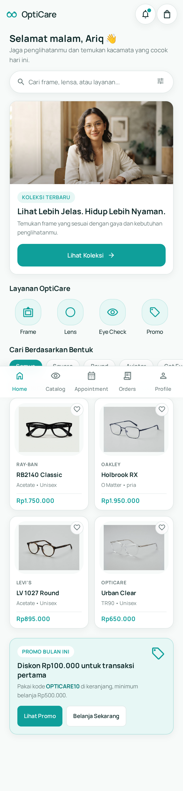
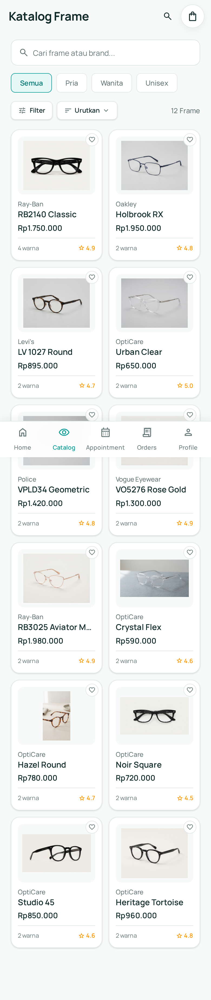
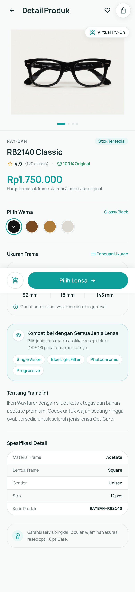
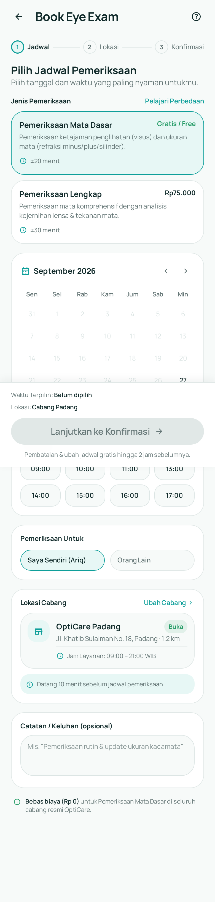
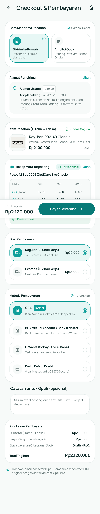
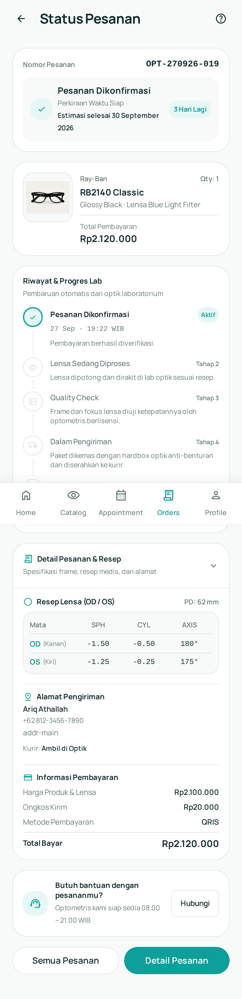
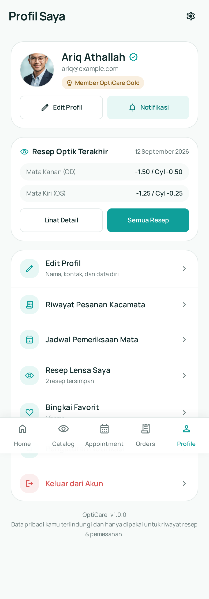

# OptiCare — Customer Web App

Web app katalog, booking pemeriksaan mata, checkout, dan order tracking OptiCare.
Mobile-first (kanonik 390×844), responsive sampai desktop, semua alur pelanggan bisa diklik dengan data mock + `localStorage`.

## Menjalankan

```bash
pnpm install
pnpm dev      # http://127.0.0.1:5173
pnpm build    # tsc -b && vite build
pnpm lint     # oxlint
python3 /tmp/opencode/check_icons.py   # validasi glyph Material Symbols (wajib sebelum klaim selesai)
```

## Screenshot

| Home | Katalog | Detail Produk |
| --- | --- | --- |
|  |  |  |

| Booking | Checkout | Order Tracking |
| --- | --- | --- |
|  |  |  |

| Profil |
| --- |
|  |

Screenshot lain (resep, appointment, pembayaran, tampilan desktop) ada di [`docs/screenshots/`](docs/screenshots/).

## Stack

Vite · React 19 · TypeScript · Tailwind CSS v4 (`@theme` di `src/index.css`) · React Router 7 · lucide-react (opsional) · oxlint.

## Rute

| Rute | Halaman |
| --- | --- |
| `/` | Home |
| `/catalog` | Katalog (search, filter, sort) |
| `/product/:id` | Detail produk |
| `/lens-selection` | Pemilihan lensa |
| `/prescription` | Input/upload resep |
| `/cart` | Keranjang (qty, promo, resep) |
| `/checkout` | Checkout (pengiriman/ambil, bayar) |
| `/payment`, `/payment/success`, `/payment/failed` | Verifikasi pembayaran (`?state=failed`) |
| `/booking`, `/booking/location`, `/booking/confirmation`, `/booking/success` | Booking pemeriksaan (3 langkah) |
| `/appointments`, `/appointments/:id` | Daftar & detail janji temu |
| `/orders`, `/orders/:id` | Daftar & detail pesanan |
| `/tracking/:id` | Order tracking (timeline) |
| `/profile`, `/profile/edit` | Profil & edit profil |
| `/profile/prescriptions`, `/profile/prescriptions/:id` | Daftar & detail resep |
| `/profile/notifications` | Preferensi notifikasi |

## State

Provider di `src/store/index.tsx`: Toast › Profile › Prescription › Favorites › Cart › Checkout › Order › Appointment › Booking.

Kunci `localStorage`: `opticare.cart`, `opticare.checkout`, `opticare.orders`, `opticare.appointments`, `opticare.booking`, `opticare.prescriptions`, `opticare.prescription.active`, `opticare.profile`, `opticare.notifications`, `opticare.favorites`.

Pola penting:

- Navigasi redirect dilakukan lewat `useEffect` (bukan saat render).
- `useCheckout().state` tidak di-reset saat pindah halaman agar konfirmasi booking/checkout tidak membatalkan navigasi.
- State UI (loading, sheet, tab, `?state=error`) ditangani di React state, bukan rute.

## Desain

- Token warna & tipografi dari `design.md` (`src/index.css` → `@theme`): `#0F9F9A` brand, `#087A77` dark, `#E7F7F5` light, `#102A2A` ink, `#667777` muted, `#E1E8E7` line.
- Ikon memakai ligature Material Symbols lewat `<Icon name="…" size={…} />` — nama glyph harus ada di `ms-names.txt` (cek dengan `check_icons.py`).
- Bottom nav 5 tab (DESIGN.md §13), disembunyikan pada flow yang punya sticky CTA (`src/components/navigation/BottomNav.tsx`).
- Komponen reusable: `PageHeader`, `Section`, `StickyBar`, `BottomSheet`, `Modal`, `Tabs`, `Field/Input/Switch/EmptyState`, `Button/IconButton`, `Badge/Chip`, `Skeleton`, `Toast`.
- Layout kanonik 390×844, `max-w-[520px]` di mobile, `md:max-w-3xl` / `lg:max-w-4xl` di desktop; cek overflow di lebar 360/390/768/1280.

## Aset

Gambar di `public/images/` (frame, hero, avatar). Sumber layar: HTML Stitch di `manifest.json` (mapping screen → rute di catatan proyek).
